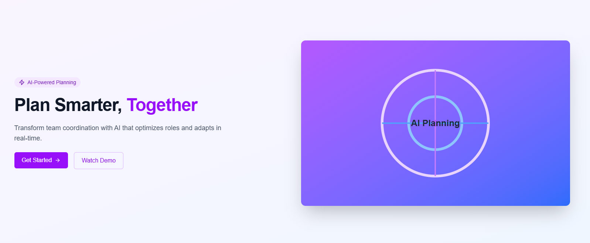

# PlanAI - AI-Powered Group Planning System

## Live View
Live view is at 

https://ai-group-planner-gvje-git-dev-weebmaniac2314-gmailcoms-projects.vercel.app/


This is a [Next.js](https://nextjs.org) project bootstrapped with [`create-next-app`](https://nextjs.org/docs/app/api-reference/cli/create-next-app).

[](https://nextjs.org/)
[](https://www.typescriptlang.org/)
[](https://firebase.google.com/)
[](https://tailwindcss.com/)
[](https://opensource.org/licenses/MIT)



## 📋 Overview

PlanAI is a sophisticated, AI-driven platform designed to revolutionize how teams plan, coordinate, and execute projects. By leveraging artificial intelligence, PlanAI processes input from multiple stakeholders to generate optimized plans with intelligent role assignments, task distributions, and real-time adaptations.

### 🌟 Key Features

- **AI-Generated Planning** - Create comprehensive plans with tasks, deadlines, and role suggestions
- **Real-Time Collaboration** - Collaborate with team members in real-time with chat integration
- **Smart Task Assignment** - Intelligently distribute tasks based on member skills and capacity
- **Activity Tracking** - Monitor project progress with detailed activity feeds
- **File Sharing** - Share and manage documents within your team
- **Customizable Dashboard** - Personalize your workspace with a widget-based dashboard
- **Advanced Analytics** - Track progress and performance metrics with visual analytics
- **Notification System** - Stay updated with real-time notifications
- **User Management** - Invite members and manage permissions with role-based access control

## 🚀 Getting Started

### Prerequisites

- Node.js 18.x or higher
- npm/yarn
- Firebase account

### Installation

1. **Clone the repository**
   ```bash
   git clone https://github.com/sarbeshkc/ai-group-planner.git
   cd ai-group-planner
   ```

2. **Install dependencies**
   ```bash
   npm install
   # or
   yarn install
   ```

3. **Set up Firebase**
   - Create a Firebase project at [Firebase Console](https://console.firebase.google.com/)
   - Enable Authentication (Email/Password), Firestore Database, and Storage
   - Create a web app in your Firebase project and get the configuration
   - Deploy the Firestore security rules from the firestore.rules file

4. **Configure environment variables**
   Create a `.env.local` file in the root directory with the following:
   ```
   NEXT_PUBLIC_FIREBASE_API_KEY=your-api-key
   NEXT_PUBLIC_FIREBASE_AUTH_DOMAIN=your-project-id.firebaseapp.com
   NEXT_PUBLIC_FIREBASE_PROJECT_ID=your-project-id
   NEXT_PUBLIC_FIREBASE_STORAGE_BUCKET=your-project-id.appspot.com
   NEXT_PUBLIC_FIREBASE_MESSAGING_SENDER_ID=your-messaging-sender-id
   NEXT_PUBLIC_FIREBASE_APP_ID=your-app-id
   NEXT_PUBLIC_FIREBASE_MEASUREMENT_ID=your-measurement-id
   NEXT_PUBLIC_HUGGINGFACE_API_KEY=your-huggingface-api-key
   ```

5. **Run the development server**
   ```bash
   npm run dev
   # or
   yarn dev
   ```

6. **Access the application**
   Open [http://localhost:3000](http://localhost:3000) in your browser

### Deploying to Production

**Deploy to Vercel**
```bash
npm run build
# or
vercel deploy
```

## 🔍 Project Structure

```
ai-group-planner/
├── public/                # Static files
├── src/
│   ├── app/               # Next.js App Router pages
│   │   ├── dashboard/     # Dashboard pages
│   │   ├── groups/        # Group management pages
│   │   ├── plans/         # Plan management pages
│   │   ├── login/         # Authentication pages
│   │   └── ...
│   ├── components/        # React components
│   │   ├── layout/        # Layout components
│   │   ├── ui/            # UI components
│   │   ├── dashboard/     # Dashboard widgets
│   │   ├── chat/          # Chat components
│   │   ├── files/         # File sharing components
│   │   └── ...
│   ├── lib/               # Utility functions and modules
│   │   ├── firebase/      # Firebase configuration and helpers
│   │   ├── ai/            # AI integration modules
│   │   └── ...
│   └── ...
├── firestore.rules        # Firestore security rules
├── tailwind.config.js     # Tailwind CSS configuration
└── ...
```

## 🧩 Features in Detail

### AI-Powered Plan Generation

PlanAI uses both rule-based algorithms and integration with Hugging Face's AI models to generate comprehensive project plans. The system:

- Analyzes objectives, timelines, and team composition
- Creates structured tasks with priorities and dependencies
- Suggests role assignments based on project needs
- Provides recommendations for optimal execution

### Collaborative Features

- **Real-time Chat**: Group messaging with direct mentions
- **Activity Feed**: Live updates on group and project activities
- **Comments System**: Threaded discussions on tasks and plans
- **File Sharing**: Secure document exchange with preview support
- **User Presence**: See who's currently active in your group

### Advanced Dashboard

- **Customizable Widgets**: Drag-and-drop interface for personalization
- **Analytics Charts**: Visual representation of progress and performance
- **Task Management**: Quick access to pending and upcoming tasks
- **Calendar View**: Timeline visualization of deadlines and milestones

### Role-Based Access Control

- **Permission Levels**: Owner, Admin, Member, and Viewer roles
- **Contextual Actions**: Interface adapts to user permissions
- **Invitation System**: Streamlined onboarding for new team members

## 📊 Analytics and Reporting

PlanAI provides detailed analytics to help teams measure performance and progress:

- **Task Completion Rates**: Track productivity over time
- **Plan Progress**: Visual indicators of milestone achievement
- **Team Performance**: Identify bottlenecks and optimization opportunities
- **Activity Metrics**: Measure engagement and collaboration levels

## 🔮 Future Enhancements

- **AI Task Assignment Optimization**: Machine learning for even smarter task assignment
- **Natural Language Processing**: Create plans from plain text descriptions
- **Integration Ecosystem**: Connect with popular tools like Slack, Trello, and GitHub
- **Advanced Reporting**: Export detailed performance reports
- **Mobile Applications**: Native iOS and Android apps

## 🤝 Contributing

Contributions are welcome! Please feel free to submit a Pull Request.

1. Fork the repository
2. Create your feature branch (`git checkout -b feature/amazing-feature`)
3. Commit your changes (`git commit -m 'Add some amazing feature'`)
4. Push to the branch (`git push origin feature/amazing-feature`)
5. Open a Pull Request

Please make sure to update tests as appropriate and adhere to the code style guidelines.

## 📄 License

This project is licensed under the MIT License - see the LICENSE file for details.

## 📬 Contact

Sarbesh KC - [@sarbeshkc](https://github.com/sarbeshkc)

Project Link: [https://github.com/sarbeshkc/ai-group-planner](https://github.com/sarbeshkc/ai-group-planner)

---
